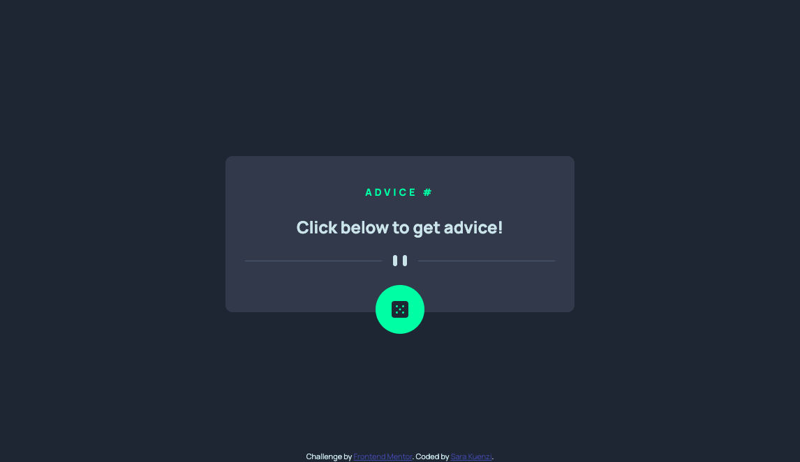
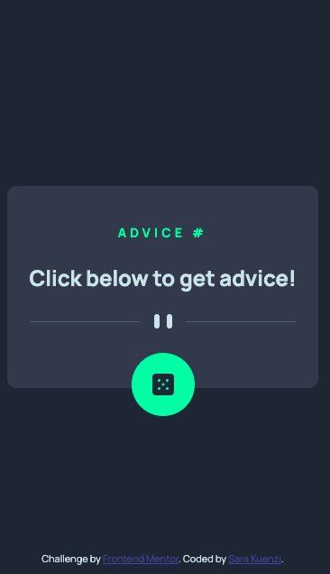

# Frontend Mentor - Advice generator app solution

This is a solution to the [Advice generator app challenge on Frontend Mentor](https://www.frontendmentor.io/challenges/advice-generator-app-QdUG-13db). Frontend Mentor challenges help you improve your coding skills by building realistic projects.

## Table of contents

- [Overview](#overview)
  - [The challenge](#the-challenge)
  - [Screenshot](#screenshot)
  - [Links](#links)
- [My process](#my-process)
  - [Built with](#built-with)
  - [What I learned](#what-i-learned)
  - [Continued development](#continued-development)
  - [Useful resources](#useful-resources)
- [Author](#author)
- [Acknowledgments](#acknowledgments)

**Note: Delete this note and update the table of contents based on what sections you keep.**

## Overview

### The challenge

Users should be able to:

- View the optimal layout for the app depending on their device's screen size
- See hover states for all interactive elements on the page
- Generate a new piece of advice by clicking the dice icon

### Screenshot





### Links

- Solution URL: [Add solution URL here](https://your-solution-url.com)
- Live Site URL: [Add live site URL here](https://your-live-site-url.com)

## My process

### Built with

- Semantic HTML5 markup
- CSS custom properties
- Flexbox
- Mobile-first workflow
- Vanilla Javascript


### What I learned

This was a return to Vanilla Javacript after spending several months with React. I had to remember how to write code that directly alters the DOM instead of the virtual DOM in React. 

I also faced a challenge that I often think about with my projects: removing the focus after the button is clicked. I find it really annoying that the focus state remains after click but I want to keep my apps accessible. I found an article on Medium by David Gilbertson that explained a workaround. I linked the article below, but basically he adds a function that listens for the tab key and turns on a class when the tab key is pressed (for keyboard users). If no tab is pressed, the focus is removed. 

```css
.icon-container:focus {
    box-shadow: 0px 0px 50px 4px var(--neongreen);
    outline: none;
}

body:not(.user-is-tabbing) .icon-container:focus {
    outline: none;
    box-shadow: none;
}

body:not(.user-is-tabbing) .icon-container:active,
body:not(.user-is-tabbing) .icon-container:hover
 {
    box-shadow: 0px 0px 50px 4px var(--neongreen);
    outline: none;
}
```
Everything else, like the fetch and rendering, was fairly straightforward.

### Continued development

I am definitely going to be using this :focus method for future projects. 

### Useful resources

- [:focus ring and accessibility](https://medium.com/hackernoon/removing-that-ugly-focus-ring-and-keeping-it-too-6c8727fefcd2) - This is the article that helped me prevent the focus ring remaining on the element after click.

## Author

- Website - [Sara Kuenzi](https://skuenzi.github.io)
- Frontend Mentor - [@skuenzi](https://www.frontendmentor.io/profile/skuenzi)
- Github - [skuenzi](https://github.com/skuenzi)